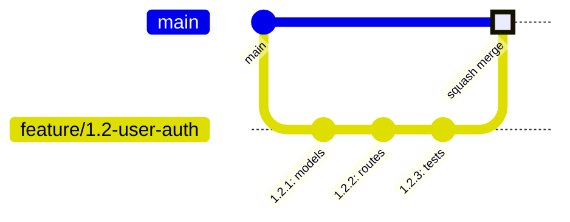
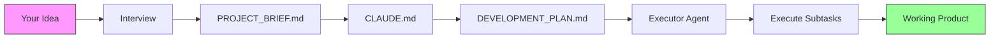
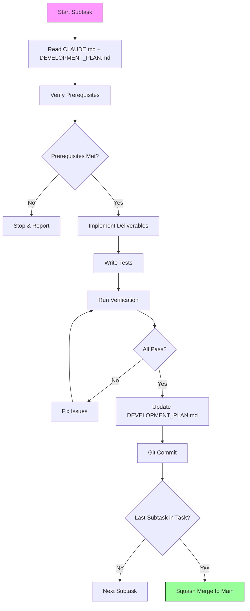

# 🎯 Claude Code Dev Plan Builder

> **Turn your product idea into a production-ready development plan in minutes**

Tell Claude Code to read this repo, and it will guide you through building a comprehensive, paint-by-numbers development plan with all the testing, git discipline, and best practices baked in.

---

## 🚀 Quick Start (For Users)

**Got a product idea? Here's all you need to do:**

### Step 1: Start a Conversation with Claude Code

In your new project repository, paste this prompt:

```
Go read the README at https://github.com/mmorris35/ClaudeCode-DevPlanBuilder and help me develop my idea into a complete development plan.
```

### Step 2: Answer Claude's Questions

Claude Code will guide you through creating a `PROJECT_BRIEF.md` by asking about:
- What you're building (the goal)
- Who it's for (target users)
- What it needs to do (key features)
- Your tech stack (if decided)
- Timeline and constraints

### Step 3: Get Your Development Plan

Claude Code will generate:
- ✅ **CLAUDE.md** - Rules for how Claude Code should work on your project
- ✅ **PROJECT_BRIEF.md** - Your requirements captured in a structured format
- ✅ **DEVELOPMENT_PLAN.md** - Paint-by-numbers roadmap with numbered subtasks
- ✅ **`.claude/agents/{project}-executor.md`** - Specialized agent to execute your plan

### Step 4: Build Your Product

Use this simple prompt for every work session (replace `{project}` with your project name):

```
Use the {project}-executor agent to execute subtask [X.Y.Z]
```

Replace `[X.Y.Z]` with the next subtask number (like `0.1.1`, `1.2.3`, etc.)

**That's it!** Claude Code will:
- Complete each subtask fully (2-4 hours of work)
- Write comprehensive tests (>80% coverage)
- Run linting and type checking
- Commit to the task's feature branch (NOT create a new branch per subtask)
- Update progress in DEVELOPMENT_PLAN.md

---

## 🎨 What Makes This "Paint by Numbers"?

Your development plan will have:

1. **Numbered subtasks** (0.1.1, 0.1.2, etc.) - Always know what's next
2. **3-7 specific deliverables per subtask** - Clear checkboxes for completion
3. **Single-session sizing** - Each subtask takes 2-4 hours max
4. **Explicit prerequisites** - No guessing about order
5. **Success criteria** - Objective verification of completion
6. **Git workflow at TASK level** - One feature branch per task (NOT per subtask!)
7. **Commits per subtask** - Each subtask commits to the task's branch, squash merge when task complete
8. **Testing throughout** - Not an afterthought, >80% coverage required
9. **Quality gates** - Linting, type checking, validation at every step
10. **Completion notes** - Knowledge capture for every subtask
11. **One simple prompt** - Same format for every session

### ⚠️ Git Workflow: TASK-Level Branching

**IMPORTANT**: Branches are created at the **TASK** level, NOT the subtask level!



- **One branch per task** (e.g., `feature/1.2-user-auth`)
- **Multiple commits per task** (one for each subtask)
- **Squash merge when task complete** (not after each subtask)

### ✅ Task Complete Checkpoints

Every task in your DEVELOPMENT_PLAN.md ends with an explicit merge checkpoint:

```markdown
### ✅ Task X.Y Complete - Squash Merge to Main

**When all subtasks (X.Y.1, X.Y.2, ...) are complete:**

git push -u origin feature/X-Y-description
gh pr create --title "type: description" --body "Task X.Y complete"
gh pr merge --squash --delete-branch

**Checklist:**
- [ ] All subtasks complete
- [ ] All tests pass
- [ ] PR created and squash merged to main
- [ ] Feature branch deleted
```

This ensures you never forget the merge step - it's explicit in the plan, not something you need to remember.

### 🤖 The Executor Agent

Each project gets a specialized agent file at `.claude/agents/{project-name}-executor.md`. This agent:

- **Knows your project** - Has context about tech stack, architecture, and phases
- **References your docs** - Reads CLAUDE.md, PROJECT_BRIEF.md, and DEVELOPMENT_PLAN.md
- **Expects executable plans** - Plans must have complete, copy-pasteable code (not vague descriptions)
- **Follows git discipline** - One branch per task, commits per subtask, verification before commits

**To use the agent**, invoke it with a subtask:
```
@taskflow-executor execute subtask 1.2.3
```

The agent will read your planning documents, verify prerequisites, implement the deliverables, run verification, and commit the changes.

### ⚠️ Common Mistakes with Executor Agents

Claude sometimes makes errors when creating executor agent files. Watch for these:

**❌ Wrong - YAML list for tools:**
```yaml
tools:
  - Read
  - Write
  - Edit
```

**✅ Correct - Comma-separated string:**
```yaml
tools: Read, Write, Edit, Bash, Glob, Grep
```

**❌ Wrong - Using sonnet model:**
```yaml
model: sonnet
```

**✅ Correct - Using haiku model:**
```yaml
model: haiku
```

Using `sonnet` defeats the purpose of having an executor agent. The agent should be lightweight (`haiku`) since the development plans are designed to be "Haiku-executable" - containing complete, copy-pasteable code that doesn't require inference.

**❌ Wrong - Missing frontmatter delimiters:**
```yaml
name: my-executor
tools: Read, Write
```

**✅ Correct - With delimiters:**
```yaml
---
name: my-executor
description: PROACTIVELY use this agent to execute...
tools: Read, Write, Edit, Bash, Glob, Grep
model: haiku
---
```

The MCP server includes a `devplan_validate_agent` tool that checks for these common mistakes.

---

## 📚 What's In This Repo?

This repository contains:

### For Users (You!)

- **[PROMPT_SEQUENCE.md](PROMPT_SEQUENCE.md)** - Detailed guide with all the prompts you'll need
- **[PROJECT_BRIEF.md](PROJECT_BRIEF.md)** - Example of a complete project brief (for this tool itself!)
- **This README** - Everything you need to get started

### Example Artifacts (What You'll Get)

The **[examples/hello-cli/](examples/hello-cli/)** directory contains a complete, minimal example showing exactly what Claude Code generates:

- **[PROJECT_BRIEF.md](examples/hello-cli/PROJECT_BRIEF.md)** - Your requirements in structured format
- **[CLAUDE.md](examples/hello-cli/CLAUDE.md)** - Coding standards and session checklist
- **[DEVELOPMENT_PLAN.md](examples/hello-cli/DEVELOPMENT_PLAN.md)** - **Haiku-executable** plan with complete code blocks
- **[hello-cli-executor.md](examples/hello-cli/hello-cli-executor.md)** - Specialized executor agent

This example demonstrates the key principle: **every subtask contains copy-pasteable code**, not vague descriptions. Claude Haiku can execute these plans mechanically.

---

## 💡 How Claude Code Will Help You

When you ask Claude Code to help you develop your idea, it will:



### 1. **Interview You** About Your Project

Claude will ask clarifying questions like:
- "What problem does this solve?"
- "Who are your target users?"
- "What are the must-have features for MVP?"
- "What's your tech stack? (Or would you like recommendations?)"
- "What's your timeline?"

### 2. **Create Your PROJECT_BRIEF.md**

A comprehensive document covering:
- Basic information (name, type, goal, users, timeline)
- Functional requirements (input, output, key features)
- Technical constraints (must-use tech, cannot-use, deployment)
- Quality requirements (performance, security, scalability)
- Success criteria

### 3. **Generate CLAUDE.md**

Project-specific rules defining:
- How Claude Code should work on YOUR project
- Testing requirements (coverage, frameworks)
- Code quality standards (linting, type checking, style guides)
- Git workflow and commit standards
- Build verification steps
- Project-specific best practices

### 4. **Build DEVELOPMENT_PLAN.md**

A complete roadmap with:
- **Phase 0: Foundation** - Repo setup, dependencies, CI/CD
- **Phase 1-N: Development** - Your features broken into digestible pieces
- **Final Phase: Testing & Distribution** - Polish and release

Each **task** includes:
- **Git Strategy** - Branch name, commit prefix, merge strategy (one branch per task, all subtasks commit to it)

Each **subtask** includes:
- Exact deliverables (what to build)
- Files to create/modify (where to build it)
- Success criteria (how to verify it works)
- Completion notes template (knowledge capture)

### 5. **Create an Executor Agent**

A specialized agent file at `.claude/agents/{project-name}-executor.md` that:
- Has your project context baked in (tech stack, phases, directory structure)
- References CLAUDE.md, PROJECT_BRIEF.md, and DEVELOPMENT_PLAN.md
- Expects "Haiku-executable" plans with complete, copy-pasteable code
- Follows strict git discipline (verify → implement → test → commit)

### 6. **Guide You Through Execution**



For every subtask, Claude Code will:
- Read the full context (CLAUDE.md + DEVELOPMENT_PLAN.md)
- Implement all deliverables
- Write comprehensive tests
- Run quality checks (linting, type checking)
- Update completion notes
- Create semantic git commit

---

## 🎯 Who Is This For?

### Perfect For:

- ✅ **Solo developers** building side projects or startups
- ✅ **Small teams** wanting consistent development practices
- ✅ **Experienced developers** who want to move fast with quality
- ✅ **Anyone using Claude Code** for software development

### Works Great For These Project Types:

- 🖥️ **CLI Tools** - Command-line applications and utilities
- 🌐 **Web Apps** - Full-stack web applications
- 🔌 **APIs** - RESTful services and microservices
- 📦 **Libraries** - Reusable packages and frameworks
- 🤖 **Automation Tools** - Scripts and workflow automation

---

## 📖 Documentation & Resources

### Essential Reading

- **[PROMPT_SEQUENCE.md](PROMPT_SEQUENCE.md)** - Complete guide with all prompts
  - 6-step setup sequence
  - Special situation prompts
  - Quality checkpoint prompts
  - Git strategy guidance
- **[docs/EXECUTOR_AGENT.md](docs/EXECUTOR_AGENT.md)** - Create your executor agent
  - Frontmatter format reference
  - Common mistakes to avoid
  - Complete template ready to copy
- **[docs/HAIKU_EXECUTABLE_PLANS.md](docs/HAIKU_EXECUTABLE_PLANS.md)** - Guide to writing plans that simpler models can execute
  - What makes a plan "Haiku-executable"
  - Recommended subtask structure
  - Before/after examples
- **[docs/AUTONOMOUS_EXECUTION.md](docs/AUTONOMOUS_EXECUTION.md)** - Run the executor agent hands-free
  - When `--dangerously-skip-permissions` is safe (and when it's not)
  - Commands for executing subtasks, tasks, phases, or entire projects
  - Monitoring progress and troubleshooting

### Advanced

- **[MULTI_AGENT_INFRASTRUCTURE.md](MULTI_AGENT_INFRASTRUCTURE.md)** - Multi-agent setups with NATS messaging
  - Only needed if you require multiple collaborating agents
  - NATS JetStream, SQLite, MCP servers

### Example Artifacts

- **[examples/hello-cli/](examples/hello-cli/)** - Complete Haiku-executable example
  - PROJECT_BRIEF.md, CLAUDE.md, DEVELOPMENT_PLAN.md, executor agent
- **[PROJECT_BRIEF.md](PROJECT_BRIEF.md)** - This tool's own project brief (larger scale example)
- **[claude.md](claude.md)** - This tool's own coding standards

### Quick Reference

**Standard session prompt** (use this every time, replacing `{project}` with your project name):
```
Use the {project}-executor agent to execute subtask [X.Y.Z]
```

**When a subtask is too large:**
```
Use the {project}-executor agent to break down subtask [X.Y.Z] into 2-3 smaller subtasks that each take 2-4 hours, have 3-7 deliverables, and can be completed independently.
```

**Progress validation:**
```
Use the {project}-executor agent to review Phase [X] completion: verify all completion notes, run tests, and provide a Phase [X] completion report before moving to Phase [Y].
```

---

## 🏗️ What This Repository Actually Is

This is **both**:

1. **A methodology** for building development plans with Claude Code
   ✅ **READY TO USE** - The prompt sequences and examples are battle-tested

2. **A working CLI tool** that automates plan generation
   ✅ **USABLE** - Core features complete, validation/distribution in progress

The tool was built using its own generated development plan - eating our own dog food! 🎉

### Development Roadmap

**The CLI Tool Progress:**

```mermaid
gantt
    title DevPlan Builder Progress
    dateFormat X
    axisFormat %s

    section Core
    Foundation       :done, 0, 1
    Data Models      :done, 1, 2
    Parser           :done, 2, 3
    Templates        :done, 3, 4
    Generators       :done, 4, 5
    CLI Commands     :done, 5, 6

    section Polish
    Validation       :active, 6, 7
    Git Integration  :7, 8
    Testing & Docs   :8, 9
    Distribution     :9, 10
```



| Phase | Status | Description |
|-------|--------|-------------|
| **Phase 0: Foundation** | ✅ Complete | Repo setup, package structure, pre-commit hooks, CI/CD |
| **Phase 1: Data Models** | ✅ Complete | ProjectBrief, Phase/Task/Subtask models, TechStack |
| **Phase 2: Parser** | ✅ Complete | Markdown parser, field extractor, ProjectBrief converter |
| **Phase 3: Templates** | ✅ Complete | Template selector, Jinja2 renderer, project-type templates |
| **Phase 4: Generators** | ✅ Complete | Tech stack, phase, task, subtask generators |
| **Phase 5: CLI Commands** | ✅ Complete | `claude-planner generate`, `validate`, `list-templates` |
| **Phase 6: Validation** | 🚧 In Progress | Validation rules engine, comprehensive reporting |
| **Phase 7: Git Integration** | ⏳ Planned | Repository initialization, initial commit creation |
| **Phase 8: Testing & Docs** | ⏳ Planned | Integration tests, end-to-end tests |
| **Phase 9: Distribution** | ⏳ Planned | PyPI publishing |

### What Works Right Now

✅ **The Methodology** - Use PROMPT_SEQUENCE.md to build dev plans for ANY project
✅ **CLI Tool** - `claude-planner generate`, `validate`, `list-templates`
✅ **MCP Server** - DevPlan tools for Claude Code integration
✅ **Executor Agents** - Haiku-powered agents that execute your plans
✅ **Autonomous Mode** - Build entire projects hands-free

### What's Coming

🚧 **Enhanced Validation** - Deeper quality checks and error reporting
🚧 **Git Integration** - Automatic repository initialization
🚧 **PyPI Distribution** - `pip install claude-planner`

### How to Use It Today

**Option 1: Use the Methodology** (Recommended)
- Follow [PROMPT_SEQUENCE.md](PROMPT_SEQUENCE.md)
- Let Claude Code guide you through building your development plan
- Works for any project, any tech stack

**Option 2: Use the CLI Tool**
```bash
# Install (from source for now)
pip install -e .

# Generate a development plan
claude-planner generate my-project --brief PROJECT_BRIEF.md

# List available templates
claude-planner list-templates
```

**Option 3: Use the MCP Server**
- Add the DevPlan MCP server to Claude Code
- Use tools like `devplan_generate_plan`, `devplan_generate_agent`

---

## 🎓 Example Workflow

Here's what a typical project looks like:

### Session 1: Planning (30-60 minutes)
```
You: Go read the README at https://github.com/mmorris35/ClaudeCode-DevPlanBuilder
     and help me develop my idea

Claude: [Asks questions about your project]
You: [Answers questions]
Claude: [Creates PROJECT_BRIEF.md]
You: [Reviews and approves]

Claude: [Creates claude.md]
You: [Reviews and approves]

Claude: [Creates DEVELOPMENT_PLAN.md with all phases/tasks/subtasks]
You: [Reviews and approves]

Claude: [Validates the plan]
You: [Git commit - your plan is ready!]
```

### Session 2: Foundation (2-4 hours)
```
You: Use the taskflow-executor agent to execute subtask 0.1.1

Claude: [Completes subtask 0.1.1]
        [Runs tests, linting, type checking]
        [Updates DEVELOPMENT_PLAN.md]
        [Creates git commit]

You: [Reviews] Looks good!

You: Use the taskflow-executor agent to execute subtask 0.1.2

Claude: [Completes subtask 0.1.2]
...
```

### Sessions 3-N: Development (2-4 hours each)
```
You: Use the taskflow-executor agent to execute subtask [next ID]

Claude: [Completes subtask]
You: [Reviews, commits, moves to next]
```

Just keep going until all subtasks are complete!

---

## 🚀 Autonomous Execution (Hands-Free Mode)

Want Claude to build your entire project without asking for approval at every step? You can run in autonomous mode using `--dangerously-skip-permissions`.

### When Is This Safe?

**Safe for:**
- ✅ Brand new projects in isolated directories
- ✅ Directories containing only DevPlan-generated planning files
- ✅ Development machines (not production servers)

**Not safe for:**
- ❌ Existing production code
- ❌ Directories with sensitive data or credentials
- ❌ System directories or your home folder

The flag is called "dangerously" for a reason - it bypasses safety prompts. For greenfield projects in isolated folders, this is fine. For anything touching production, **don't use this flag**.

### Quick Example

```bash
# Execute a single subtask autonomously (replace {project} with your project name)
claude --dangerously-skip-permissions \
  "Use the {project}-executor agent to execute subtask 1.2.3"

# Execute an entire phase
claude --dangerously-skip-permissions \
  "Use the {project}-executor agent to execute all tasks in Phase 1. For each task: create feature branch, complete all subtasks with commits, merge when done."

# Build the entire project
claude --dangerously-skip-permissions \
  "Use the {project}-executor agent to execute the entire development plan from current progress. Follow git discipline throughout."
```

### Recommended Workflow

1. **Plan interactively** - Answer interview questions, review generated files
2. **Execute Phase 0 interactively** - Set up foundation with your oversight
3. **Switch to autonomous for development phases** - Let Claude build while you grab coffee
4. **Review between phases** - Check git history, run tests, verify progress

See **[docs/AUTONOMOUS_EXECUTION.md](docs/AUTONOMOUS_EXECUTION.md)** for the complete guide including safety checklists, troubleshooting, and monitoring tips.

---

## 💪 Why This Works

### Traditional Approach:
- ❌ Vague requirements
- ❌ No clear next step
- ❌ Testing as an afterthought
- ❌ Inconsistent code quality
- ❌ No progress tracking
- ❌ Git history is a mess

### With Dev Plan Builder:
- ✅ Crystal clear requirements (PROJECT_BRIEF.md)
- ✅ Always know what's next (numbered subtasks)
- ✅ Tests written alongside code (every subtask)
- ✅ Quality enforced (linting, type checking, pre-commit hooks)
- ✅ Progress visible (checkboxes, completion notes)
- ✅ Clean git history (semantic commits, one per subtask)

---

## 🤝 Contributing

Want to improve the methodology or the tool? Contributions welcome!

This project follows its own strict development guidelines defined in [claude.md](claude.md). Each subtask must:
- Be completed in a single session
- Include comprehensive tests (>80% coverage)
- Pass all linting and type checking
- End with a semantic git commit

---

## 📜 License

MIT License - see [LICENSE](LICENSE) file for details

Use this for anything - personal projects, commercial products, open source, whatever!

---

## 🙏 Acknowledgments

Built with [Claude Code](https://claude.ai/claude-code) - An AI pair programmer that executes development plans with precision.

This methodology emerged from real-world usage of Claude Code on production projects. It codifies best practices for:
- Project planning and task breakdown
- Testing and quality assurance
- Git workflow and discipline
- Progress tracking and knowledge capture

---

## 🚀 Ready to Start?

**Just paste this in Claude Code:**

```
Go read the README at https://github.com/mmorris35/ClaudeCode-DevPlanBuilder and help me develop my idea into a complete development plan.
```

**Then answer Claude's questions about your project, and you're off to the races!** 🎉

---

## ❓ Questions?

- 📖 **Read**: [PROMPT_SEQUENCE.md](PROMPT_SEQUENCE.md) for detailed guidance
- 👀 **See**: [examples/hello-cli/](examples/hello-cli/) for a complete Haiku-executable example
- 🔍 **Learn**: [docs/HAIKU_EXECUTABLE_PLANS.md](docs/HAIKU_EXECUTABLE_PLANS.md) for writing better plans
- 💬 **Ask**: Open an issue at https://github.com/mmorris35/ClaudeCode-DevPlanBuilder/issues

---

**Built with Claude Code • Powered by Anthropic • Open Source MIT License**
